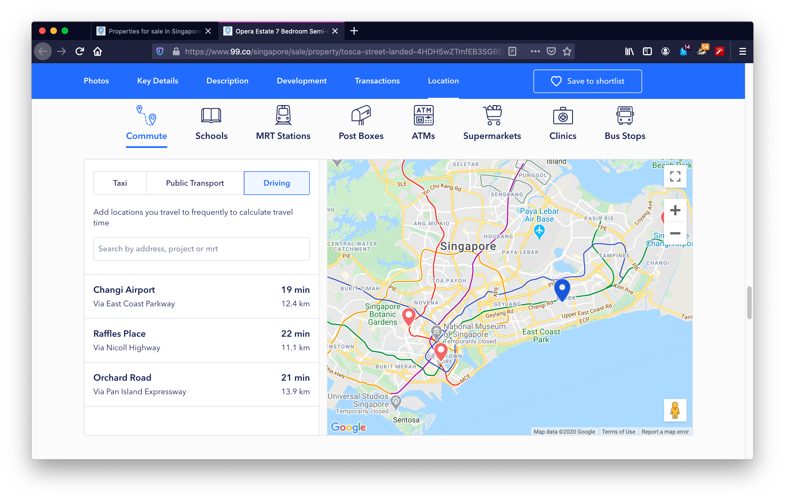
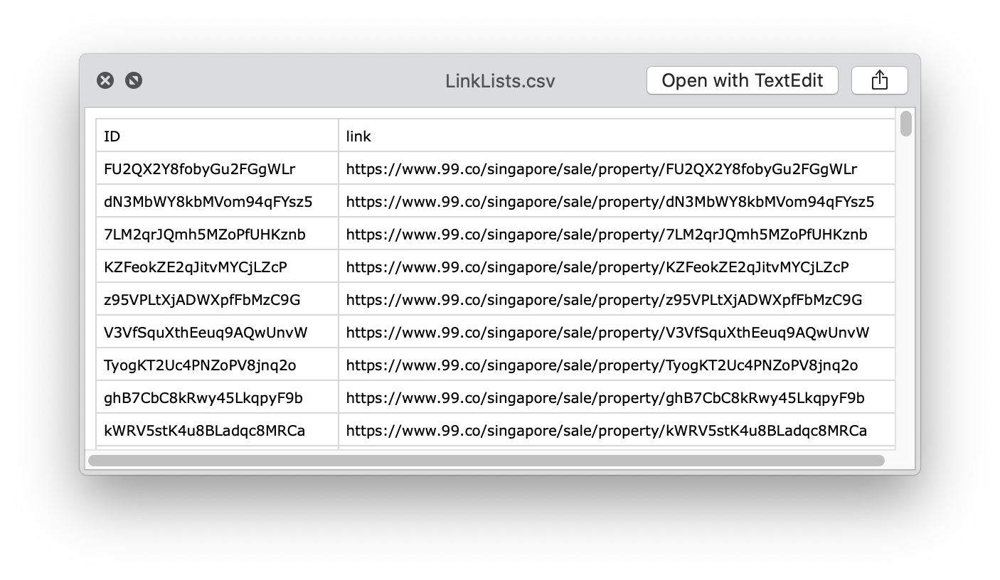
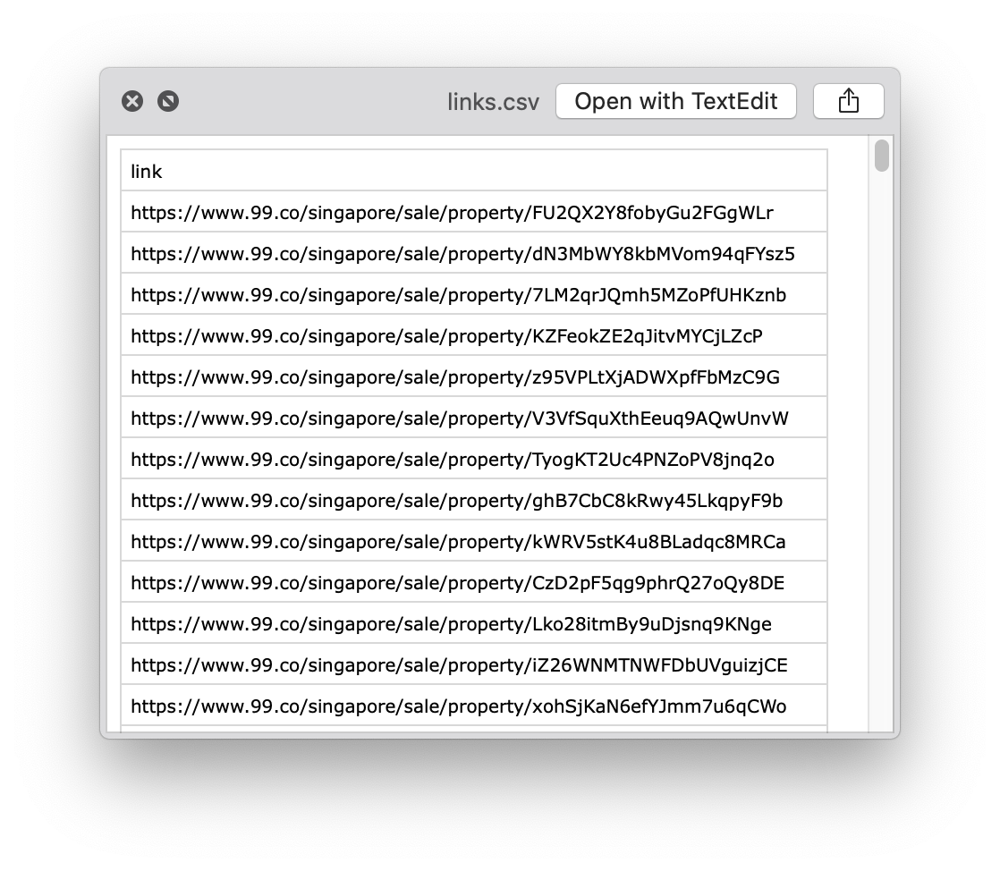
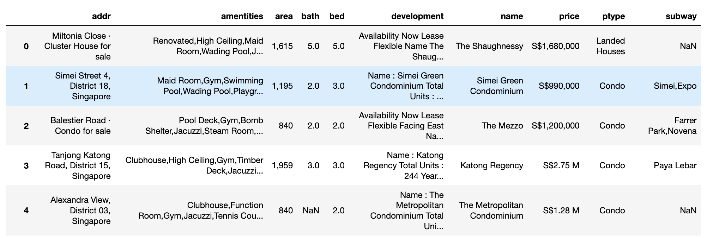

# Singapore Property Scraper with Python using Scrapy and Selenium
       
## Contents
        
<!-- toc -->

- [About the Website](#About-the-Website)
- [Choosing the Right Path: Interactive Approach](#Choosing-the-Right-Path-Interactive-Approach)
- [Scrapy Mechanism](#Scrapy-Mechanism)
  * [Structure](#Structure)
  * [Mechanism](#Mechanism)
  * [Execution](#Execution)
- [Output](#Output)
  * [LinkLists.csv](#LinkListscsv)
  * [links.csv](#linkscsv)
  * [property.csv](#propertycsv)
- [Preliminary Visualization](#Preliminary-Visualization)

<!-- tocstop -->


## About the Website

[www.99.co](https://www.99.co/) is a Singapore property trading platform, where property agents can publish information about the property for rent or sale. 

The structure of the website can be simplified to three main parts:

- front page 
- listing page 
- property detail page

On the front page, users can either search for properties that match certain criteria, such as nearby MRT stations or schools, or browse the complete listings by clicking "Buy" or "Rent".


On the listing page, the properties are listed on the left half and an interactive map on the right half. Page navigation is at the bottom of the page, however, we can use a shortcut and access different page numbers by adding `?page_num=2` after the list page url `https://www.99.co/singapore/sale`. Each page contains 35 listings.


There are two templates for the detail page, *Must SEE* and *normal* layout, with different `html` tags and attributes. This issue will be dealt with by first identifying the type of the template, then using different `XPATH` accordingly.


*Page layout for the MUST-SEE properties*


*Page layout for the normal properties*

In this project, I am interested in the following information, and all of them can be found in the property detail page

- the name of the property
- the approximate location of the property 
- its amentities
- build up area 
- price 
- location 
- type of the property (HDB, Condo, etc)
- nearby MRTs 
- number of bedrooms
- number of bathrooms
- development information (including year build, tenure etc.)

## Choosing the Right Path: Interactive Approach

I decided to use Selenium and Scrapy as the scraping tool because the website is heavily JavaScript based. In order to obtain the property details, the web browser has to firstly scroll through the entire page, let the interactive section be loaded, then click on the designated area for the desired output. Taking the slide bar in the following image for an example, I am unable to extract any content from it using only static approach:



Let us first try scraping information using `scrapy shell`, the response code is `200` suggesting that our request is successfully performed. Then we use `XPATH` to extract the contents inside the slide bar.

```
➜ scrapy shell https://www.99.co/singapore/rent/property/rQNGvH6dx5K7ohUZQmhonm                   

2020-04-11 09:35:46 [scrapy.core.engine] DEBUG: Crawled (200) <GET https://www.99.co/singapore/rent/property/skypark-condo-rQNGvH6dx5K7ohUZQmhonm> (referer: None)
2020-04-11 09:35:47 [asyncio] DEBUG: Using selector: KqueueSelector
[s] Available Scrapy objects:
[s]   scrapy     scrapy module (contains scrapy.Request, scrapy.Selector, etc)
[s]   crawler    <scrapy.crawler.Crawler object at 0x105c30110>
[s]   item       {}
[s]   request    <GET https://www.99.co/singapore/rent/property/rQNGvH6dx5K7ohUZQmhonm>
[s]   response   <200 https://www.99.co/singapore/rent/property/skypark-condo-rQNGvH6dx5K7ohUZQmhonm>
[s]   settings   <scrapy.settings.Settings object at 0x105c30490>
[s]   spider     <DefaultSpider 'default' at 0x10604a7d0>
[s] Useful shortcuts:
[s]   fetch(url[, redirect=True]) Fetch URL and update local objects (by default, redirects are followed)
[s]   fetch(req)                  Fetch a scrapy.Request and update local objects 
[s]   shelp()           Shell help (print this help)
[s]   view(response)    View response in a browser
2020-04-11 09:35:47 [asyncio] DEBUG: Using selector: KqueueSelector
```
Output using static approach:
```
In [1]: response.xpath('//*[@class="_3VHFr"]').extract()    
Out[1]: []
```

Output using interactive approach: (Selenium + Scrapy)

```
>>> scrapy_selector.xpath('//*[@class="_3VHFr"]')
[<Selector xpath='//*[@class="_3VHFr"]' data='<div class="_3VHFr">Commute</div>'>]
```

Therefore, interative approach is the more appropriate choice for this project.

## Scrapy Mechanism 

### Structure 

The project contains the following files:
     
    📦wsproject  
     ┣ 📂__pycache__  
     ┣ 📂spiders  
     ┃ ┣ 📂__pycache__   
     ┃ ┣ 📜.DS_Store  
     ┃ ┣ 📜__init__.py  
     ┃ ┣ 📜a_LinkSpider.py      -> contains LinkSpider
     ┃ ┗ 📜c_PropertySpider.py  -> contains PropertySpider
     ┣ 📜.DS_Store  
     ┣ 📜EDA.html               -> EDA codes and proces in html format
     ┣ 📜EDA.ipynb              -> EDA codes and proces in Jupyter Notebook format
     ┣ 📜LinkLists.csv          -> native file generated by a_LinkSpider.py
     ┣ 📜__init__.py  
     ┣ 📜b_rmduplicates.py      -> removing duplicated items generated by LinkSpider
     ┣ 📜items.py  
     ┣ 📜links.csv              -> processed file generated by b_rmduplicates.py
     ┣ 📜middlewares.py         -> Selenium embedded
     ┣ 📜pipelines.py  
     ┣ 📜property.csv           -> native file generated by c_PropertySpider.py
     ┗ 📜settings.py

### Mechanism

The overall mechanism can be described in the following flowchart. Scrapy is responsible for extracting links to respective property page from the listing page, and saving it to a `csv` file. The `csv` file will be processed by a simple python program to ensure each entry in the list is unique. This is because the website is being constantly updated by its users and we may encounter the same content more than once. Afterwards, the `PropertySpider` will be launched, reading links from the processed `csv` file and send the links one by one to Selenium, which is embedded in the `middlewares.py` in scrapy. After Selenium is done scrolling and clicking on the page, the `page_source` is sent back to the `PropertySpider` for extracting information. 

```flowchart
st=>start: Start
e=>end: output: property.csv
op1=>operation: a. Generate a list of links from listing page: LinkLists.csv (scrapy)
op2=>operation: b. Remove duplicate items from LinkLists.csv (python)
op3=>operation: c. Go to each row of LinkLists.csv and extract property details (scrapy+selenium)

st->op1->op2->op3->e
```


### Execution

1. `cd` to the `wsproject` folder
2. run `scrapy  crawl  LinkSpider  -o  LinkLists.csv` from command line
3. scrapy will ask the user to specify the `starting page` and `last page`, in the example below, the page range is from 1 to 50.
```
project/wsproject/wsproject
➜ scrapy crawl LinkSpider -o LinkLists.csv  
Please specify the page range (min=1, max=285): 
starting page: 1
last page: 50
```
4. after the above operation is done, `LinkLists.csv` will appear in the current folder `wsproject`
5. run `python3 b_rmduplicates.py` from command line
```
project/wsproject/wsproject 
➜ python3 b_rmduplicates.py 
Duplicates have been removed.
```
6. after the message 'Duplicates have been removed.' is shown. User can start scraping the property details by typing the following command on the command line:

``` project/wsproject/wsproject 
➜ scrapy crawl PropertySpider -o property.csv
```
7. since scrapy will call for all spiders in the `spiders` folder, the following prompt will be shown, however this can be ignored by typing any integer, e.g. `1` and `1`. Please note that non-integer input will cause error and the program will be terminated.
```
Please specify the page range (min=1, max=285): 
starting page: 1 
last page: 1
```
## Output

There are total `3` output files:

- `LinkLists.csv`
- `lists.csv`
- `property.csv`

The first two are itermediate files, and only `property.csv` is the final output.

### LinkLists.csv



`LinkLists.csv` is generated by `LinkSpider`. It has two columns, `ID` and `link`. The first column contains unique identifier of the property and the second one is the url of that property, which includes the `ID`. Of course, it is not necessary to have both columns in one file, however, this is just for clarity purpose, the `ID` column will be removed in the next phase. 

### links.csv



`links.csv` is the processed `LinkLists.csv` in which the duplicated items are removed. 

### property.csv



The `property.csv` is the final output, it contains 10 columns, including:

- `addr`: the approximated address of the property
- `amentities`: the amentities come with the property
- `area`: the build-up area of the property in sqft
- `bath`: number of bathrooms
- `bed`: number of bedrooms
- `development`: the development status of the property
- `name`: the name of the property 
- `price`: the price of the property in Singapore Dollars `S$`
- `ptype`: the type of the property, 'condo', 'HDB', 'Landed Houses' or 'unknown'
- `subway`: nearby MRT stations

The raw data scraped from www.99.co needs to be further processed for EDA (Exploratory Data Analysis) purposes.

